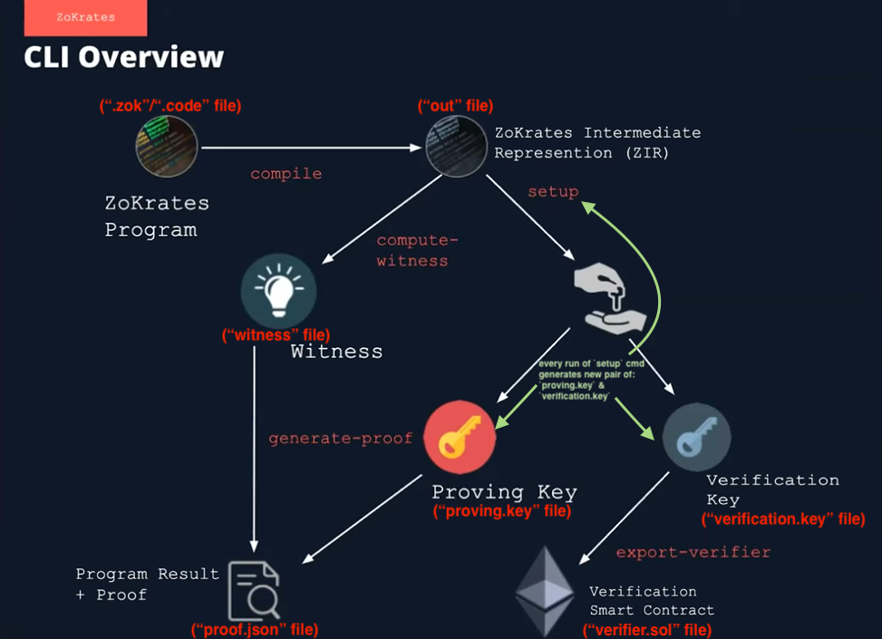

# Capstone Project: Decentralized Housing

## To run tests

- Install [`truffle`](https://trufflesuite.com/docs/truffle/getting-started/installation) of the version mentioned below
- Clone the repo
- `yarn install`
- `truffle test`

## Versions used:

```
Truffle v5.4.25 (core: 5.4.25)
Solidity - 0.8.11 (solc-js)
Node v14.18.1
Web3.js v1.5.3
ZoKrates v0.7.10
```

## Deployment addresses

On Rinkeby testnet:

- Verifier Contract: [`0xb4f536f2e6cb9388a456f98a16a18936731b48bb`](https://rinkeby.etherscan.io/address/0xb4f536f2e6cb9388a456f98a16a18936731b48bb) (code verified and published on etherscan, i.e: calls and tx can be done from etherscan directly)
  - Deployment TX: [`0xbc4eccc1f7821b5a08e096ec5d3413e8c33606b1766e52b1f3342ce631050770`](https://rinkeby.etherscan.io/tx/0xbc4eccc1f7821b5a08e096ec5d3413e8c33606b1766e52b1f3342ce631050770)
- SolnSquareVerifier Contract (the contract linking `ERC721MintableComplete` with `Verifier` contracts): [`0xb30721f2c6873aeec65e43259804ee1541a34f45`](https://rinkeby.etherscan.io/address/0xb30721f2c6873aeec65e43259804ee1541a34f45) (code verified and published on etherscan)
  - Deployment TX: [`0x7c89a150a346a435e7e3fdbc3407b2a9ed21f49d6c6187125b0179de25d01d06`](https://rinkeby.etherscan.io/tx/0x7c89a150a346a435e7e3fdbc3407b2a9ed21f49d6c6187125b0179de25d01d06)

## Development

### Using [ZoKrates](https://zokrates.github.io/gettingstarted.html):



shortcut cmd: `yarn zokrates-all`

```
cd zokrates/code
yarn zokrates compile -i ./square/square.zok
yarn zokrates setup
# generates witness with the args (fn inputs) 3 and 9 (3*3 == 9, so the inputs[1] should be 1)
yarn zokrates compute-witness -a 3 9 && cp witness ./generated/witness1
# generates `proof.json`
yarn zokrates generate-proof && cp proof.json ./generated/proof1.json
yarn zokrates export-verifier
yarn zokrates-cp && yarn format
```

For generating 10 proofs and witnesses (witness, contains the relealed info "square root"):
`for i in {3..12}; do yarn zokrates compute-witness -a $(( i * 20 )) $(( i * i * 20 * 20 )) && cp witness ./generated/witness$(( i - 2 )) && yarn zokrates generate-proof && cp proof.json ./generated/proof$(( i - 2 )).json; done;`

[OR] the detailed/manual version:

```sh
docker run -it -v ${PWD}/zokrates/code:/home/zokrates/code -w /home/zokrates/code zokrates/zokrates:0.7.10 /bin/bash

# ref: https://zokrates.github.io/gettingstarted.html
# compile - Generates: `out` binary
zokrates compile -i ./square/square.zok
# perform the setup phase - Generates: `proving.key` and `verification.key` (uses `out` binary)
zokrates setup
# execute the program - Generates: `witness` (uses `out` binary)
zokrates compute-witness -a 337 113569
# generate a proof of computation - Generates: `proof.json` (uses `proving.key` and `witness`)
zokrates generate-proof
# export a solidity verifier - Generates: `verifier.sol` (uses `verification.key`)
zokrates export-verifier
# or verify natively
zokrates verify
```

**Useful resources for ZoKrates and zk-SNARKs**

- https://www.youtube.com/watch?v=_ZvGZxhCFfE
- https://medium.com/extropy-io/zokrates-tutorial-with-truffle-41135a3fb754

---

<details>
<summary>Expand/Collapse</summary>

Source: https://github.com/udacity/Blockchain-Capstone

# Udacity Blockchain Capstone

The capstone will build upon the knowledge you have gained in the course in order to build a decentralized housing product.

## Project Steps

1. Clone the project repository
2. Explore the code base.
3. Fill out ERC721 Mintable Contract in ERC721Mintable.sol
4. Write test cases TestERC721Mintable.js
5. Compile and pass test cases in TestERC721Mintable.js
6. Implement Zokrates
   - Using Docker to install and instantiate a Zokrates zkSnarks development environment
   - Completes the Zokrates proof in square.code by adding the variable names in square.code
   - Compile program
   - Trusted setup
   - Compute witness
   - Generate Proof
   - Export Verifier.sol
   - Note: This project uses solidity version 0.5.2 so you will be required to update the code in Verifier.sol accordingly based on the compiler errors you receive
7. Write a test script to verify the solidity contract generated by Zokrates executed successfully - TestSquareVerifier.js
8. Write test contract for ZK and ERC721 integration - SolnSquareVerifier.sol
9. Compile and pass with TestSolnSquareVerifier.js
10. Deploy latest contracts generated by Zokrates (a.k.a verifier.sol)
11. Deploy SolnSquareVerifier contract to Rinkeby network
12. Mint 10 tokens
13. Generate OpenSea marketplace
14. Test and Verify OpenSea with your SolnSquareVerifier tokens
    - List 5 of your tokens on the marketplace
    - Purchase those 5 tokens using a different address
15. Complete required documentation and submit!

## Project Resources

- [Remix - Solidity IDE](https://remix.ethereum.org/)
- [Visual Studio Code](https://code.visualstudio.com/)
- [Truffle Framework](https://truffleframework.com/)
- [Ganache - One Click Blockchain](https://truffleframework.com/ganache)
- [Open Zeppelin ](https://openzeppelin.org/)
- [Interactive zero knowledge 3-colorability demonstration](http://web.mit.edu/~ezyang/Public/graph/svg.html)
- [Docker](https://docs.docker.com/install/)
- [ZoKrates](https://github.com/Zokrates/ZoKrates)
</details>
